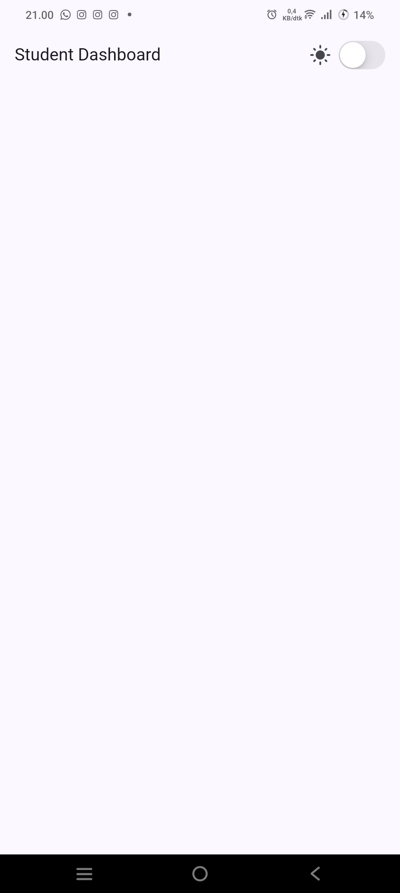
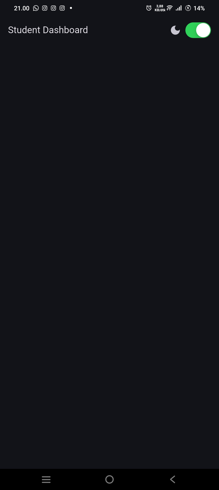

# Minggu 2 – Declarative UI & Responsive Design

- **Nama:** Handino Asa Galih R
- **Nim:** 2434107020237
- **Kelas:** TI 3E

## Tujuan Praktikum
Memahami declarative UI (widget, konfigurasi, state), memakai `StatelessWidget`, `StatefulWidget`, `Container`, `Row`, `Column`, `Expanded`, membedakan Material 3 dan Cupertino, serta membangun layout responsif dengan theme, dark mode, dan aksesibilitas dasar melalui aplikasi **Academic Overview (Student Dashboard)**.

---

## Yang Dikerjakan & Dihasilkan

| Tahap | Kegiatan | Hasil |
|---|---|---|
| Warm-up | Kartu profil `ProfileCard` + 3 eksperimen (`Expanded`, `mainAxisSize`, baris `Email`) | Kartu berisi nama, NIM, kelas |
| Setup | `flutter create responsive_dashboard` | Project berjalan di emulator/perangkat |
| Dashboard | `LayoutBuilder` + `GridView.count` + `Card` | 1 kolom (layar sempit), 2 kolom (layar lebar) |
| Interaksi | `DashboardApp` → `StatefulWidget` + `CupertinoSwitch` | Toggle light/dark mode |
| Eksperimen | Ubah breakpoint & `themeMode`, uji beberapa ukuran layar, tambah `Semantics` | Catatan pengamatan |
| **Tugas utama** | Halaman **Academic Overview** | Header profil, ≥ 4 kartu info, light/dark theme, label aksesibilitas |
| Refactoring | Widget `InfoCard`, `Theme.of(context)`, konstanta `kWideBreakpoint = 700`, `flutter analyze` | Kode bersih tanpa duplikasi |
| Testing | Widget test responsif di `test/` | 2 test lulus |
| AI Challenge | 3 prompt (desain, konsep, verifikasi) | Dokumentasi di README ini |

---

## Fitur Utama
| Fitur | Keterangan |
|---|---|
| **Header Profil** | `CircleAvatar` + nama, NIM `2434107020237`, kelas `TI 3E` |
| **Kartu Info** | Assignments, Attendance, Portfolio, Current week (widget reusable `InfoCard`) |
| **Responsif** | 1 kolom jika lebar `< 700`, 2 kolom jika `>= 700` |
| **Theme** | Material 3, `colorSchemeSeed: Colors.indigo`, `theme` + `darkTheme` |
| **Toggle Tema** | `CupertinoSwitch` di `AppBar` mengubah `themeMode` via `setState` |
| **Aksesibilitas** | `Semantics`/label bermakna, kontras terbaca di mode terang & gelap |

## Stack & Struktur
- **Bahasa/Framework:** Dart 3.13.2, Flutter SDK 3.47.2 (stable), Material 3 + Cupertino
- **Tools:** Android Studio Meerkat, Git, Flutter CLI, `flutter_test`

```
02-week-2-declarative-ui-responsive-design/
├── README.md
├── screenshots/
└── responsive_dashboard/   # lib/main.dart, test/widget_test.dart
```

## Cara Menjalankan
```bash
cd 02-week-2-declarative-ui-responsive-design/responsive_dashboard
flutter pub get
flutter run        # coba emulator ponsel (~5") lalu tablet (~10")
flutter analyze
flutter test
```

---

## Warm-up: Eksperimen `ProfileCard`


| No | Eksperimen | Hasil Pengamatan |
|---|---|---|
| 1 | Hapus `Expanded` pada baris nama | *Jika Expanded dihapus, widget Column dan teks di dalamnya akan berusaha mengambil ruang horizontal selebar teks aslinya tanpa batasan.* |
| 2 | Ganti `mainAxisSize.min` ke default | *Jika diubah ke nilai default (yaitu MainAxisSize.max), tinggi kartu akan memanjang secara vertikal hingga memenuhi seluruh ruang layar yang tersedia.* |
| 3 | Tambah baris `Email` (`Row` + `Expanded`) | *Pola Row dan Expanded digunakan agar tata letak data tetap sejajar dan rapi. Row menyusun label ("Email") dan isinya secara horizontal. Sementara itu, Expanded pada bagian label berfungsi untuk mengambil seluruh sisa ruang di tengah, sehingga secara otomatis mendorong teks isi (alamat email) agar merata dan sejajar tepat di sisi paling kanan kartu, menyerupai struktur tabel.* |

## Praktikum: Dashboard Responsif


## Eskperimen Layout
1. Ubah breakpoint dari 700 menjadi nilai lain 


2. Ubah themeMode menjadi ThemeMode.dark


3. Uji aplikasi dengan ukuran layar emulator yang berbeda.


4. Tambahkan Semantics atau label yang bermakna pada elemen yang penting bagi screen reader.

disini saya membuat `CupertinoSwitch` dan `DashboardCard` menjadi menggunakan `semantics` 
```dart
Semantics(
  label: isDark ? 'Mode gelap aktif' : 'Mode terang aktif',
  hint: 'Ketuk untuk mengganti tema',
  toggled: isDark,       // memberi tahu screen reader status on/off
  excludeSemantics: true, // mencegah duplikasi dari child widget
  child: Row(...),
)

Semantics(
  label: '$title: $value',  // contoh: "Total Mahasiswa: 1,240"
  child: Card(...),
)

```


## Testing Dasar
```dart
testWidgets('Dashboard satu kolom di layar sempit', (tester) async {
  tester.view.physicalSize = const Size(400, 800);
  tester.view.devicePixelRatio = 1.0;
  addTearDown(tester.view.reset);
  await tester.pumpWidget(const DashboardApp());
  expect(tester.getSize(find.byType(Card).first).width, lessThan(700));
});

testWidgets('Dashboard dua kolom di layar lebar', (tester) async {
  tester.view.physicalSize = const Size(1200, 800);
  tester.view.devicePixelRatio = 1.0;
  addTearDown(tester.view.reset);
  await tester.pumpWidget(const DashboardApp());
  expect(tester.getSize(find.byType(Card).first).width, greaterThan(500));
});
```

## AI Prompt Challenge

| Prompt | Isi Prompt | Output & Keputusan |
|---|---|---|
| Desain | Bandingkan dashboard `GridView` vs `LayoutBuilder` + `Column`: trade-off responsif & aksesibilitas | *Secara umum LayoutBuilder + Column untuk membangun fondasi utama layar dan merespons ukuran perangkat secara keseluruhan, kemudian menambahkan GridView di bagian dalamnya khusus untuk merender daftar konten yang seragam.* |
| Konsep | Kapan `Expanded` menyebabkan overflow di `Row`? Beri contoh gagal + perbaikan | *Expanded di dalam Row akan menyebabkan error tata letak (spesifiknya peringatan unbounded width constraint) jika Row tersebut berada di dalam parent (induk) yang memiliki ruang horizontal tak terbatas.* |
| Verifikasi | Audit rekomendasi: responsif < 600px? aksesibilitas turun? widget tersedia di Flutter stabil? | *Ya, rekomendasi tersebut dijamin responsif pada layar kecil (smartphone), pendekatan ini tidak mengurangi aksesibilitas, justru mengoptimalkannya untuk pengguna alat bantu. Ketersediaan Widgat 100% stabil. Seluruh komponen yang disebutkan adalah widget inti bawaan Flutter. Maka tidak perlu mengunduh package tambahan apa pun.* |

**Bukti verifikasi:** 


## Checklist Verifikasi
- [ ] `flutter analyze` tanpa error
- [ ] `flutter test` lulus semua
- [ ] Berjalan di layar sempit dan lebar
- [ ] Dark mode kontras & terbaca
- [ ] Struktur widget bisa dijelaskan saat code review
- [ ] Screenshot, folder `test/`, dan README tersimpan di folder Week 2

---

## Screenshot & Bukti Visual
| Bukti | Gambar |
|---|---|
| Layar sempit (light) |  |
| Layar sempit (dark) |  |
| `flutter test` & `flutter analyze` |  |

## Kendala & Solusi
**HP menolak instalasi aplikasi via USB** (`Could not create root isolate`).
Solusi: di Developer options aktifkan **USB Debugging** dan **Install via USB**, lalu setujui izin yang muncul di HP.

| Potensi kendala | Solusi |
|---|---|
| `CupertinoSwitch` tidak dikenali | `import 'package:flutter/cupertino.dart';` |
| Test gagal *Too many elements* | Pakai `find.byType(Card).first` |
| Overflow pada `Row` | Bungkus child teks dengan `Expanded` |


---

## Refleksi
### 1. **Imperative vs declarative?** 

Imperative mengubah elemen UI langkah demi langkah; declarative mendeskripsikan UI dari state saat ini dan Flutter membangun ulang bagian yang terdampak (contoh: toggle dark mode cukup mengubah `isDark`).

---

### 2. **`Expanded`: kapan membantu, kapan error?** 

Membantu membagi sisa ruang di `Row`/`Column`; error jika tidak langsung di dalam `Flex` atau berada pada sumbu tanpa batas ukuran (misalnya `Column` dalam `ListView`). Tanpa `Expanded`, teks panjang di `Row` bisa overflow.

---

### 3. **Pengaruh breakpoint & theme?** 

Breakpoint menyesuaikan struktur dengan ruang layar (1 vs 2 kolom); theme menjaga konsistensi dan kenyamanan baca, termasuk di mode gelap.

---

### 4. **Apa yang diverifikasi dari AI?** 

<table>
  <tr>
    <td></td>
    <td></td>
  </tr>
</table>

---

## Referensi
[Flutter UI](https://docs.flutter.dev/ui) · [Responsive apps](https://docs.flutter.dev/ui/layout/responsive) · [Material 3](https://m3.material.io/) · [Accessibility](https://docs.flutter.dev/ui/accessibility-and-internationalization/accessibility) · [Codelab Minggu 2](https://jti-polinema.github.io/flutter-codelab/02-minggu-2-declarative-ui-responsive-design/index.html)
