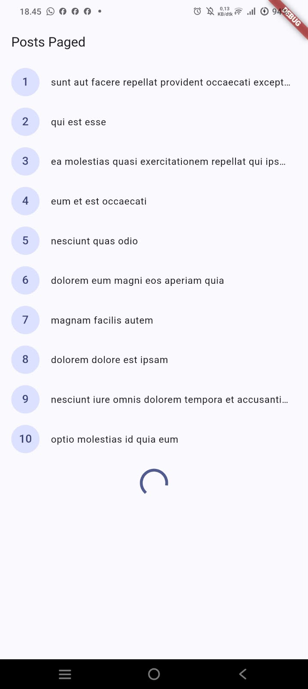

# Week 4 - Networking & Rest API

- Nama: Handino Asa Galih R
- NIM: 244107020237
- Kelas: TI 3E

### Tujuan Praktikum
Mempelajari cara menggunakan Dio dan model data dalam proyek Flutter.

## Fitur Utama Pada Praktikum
- **API Integration:** Menghubungkan aplikasi Flutter dengan REST API menggunakan Dio.
- **Data Modeling:** Konversi data JSON ke objek Dart menggunakan *factory constructor* (seperti `fromJson`).
- **State Management & Error Handling:** Mengelola status request (Data, Loading, Error) dengan `AsyncValue` dari `flutter_riverpod`.
- **Pagination:** Mengambil data dalam jumlah banyak secara bertahap (Load More/Infinite Scrolling).


### Stack Teknologi
| Kategori | Teknologi |
|---|---|
| Bahasa | Dart 3.11.5 |
| Framework | Flutter 3.41.9 |
| Navigasi | `go_router` (declarative routing, nested route, path parameter) |
| State management | `flutter_riverpod` (`Notifier`, `AsyncNotifier`, `AsyncValue`) |
| API Client | `Dio` |
| Pengujian | `flutter_test` (widget test) |
| Tools | VS Code / Android Studio, Git & GitHub |  

## Cara Menjalankan
```bash
flutter pub get
flutter run
```

## Praktikum 1: Dio dan model data
Pada praktikum ini, meng-implementasikan pembuatan Model Data dan konfigurasi Dio:

- Membuat class model (misalnya User atau Post) yang memiliki fungsi fromJson untuk memetakan hasil response API.
- Membuat file dio_client.dart yang berisi konfigurasi client Dio dan sebuah fungsi helper createDio()
- Membuat konfigurasi dasar Dio (Base URL, Timeout, Interceptors) dalam bentuk Service/Repository.

### Kode Implementasi Utama (Model / Repository):
**- Snippet Model Data**
```dart
class Post {
  const Post({
    required this.userId,
    required this.id,
    required this.title,
    required this.body,
  });

  final int userId;
  final int id;
  final String title;
  final String body;

  factory Post.fromJson(Map<String, dynamic> json) {
    return Post(
      userId: (json['userId'] as num?)?.toInt() ?? 0,
      id: (json['id'] as num?)?.toInt() ?? 0,
      title: json['title'] as String? ?? '',
      body: json['body'] as String? ?? '',
    );
  }

  Map<String, dynamic> toJson() => {
        'userId': userId,
        'id': id,
        'title': title,
        'body': body,
      };
}
```
**- Snippet Dio Client**
```dart
Dio createDio() {
  return Dio(
    BaseOptions(
      baseUrl: 'https://jsonplaceholder.typicode.com',
      connectTimeout: const Duration(seconds: 5),
      receiveTimeout: const Duration(seconds: 3),
      contentType: 'application/json; charset=utf-8',
    ),
  )..interceptors.add(LogInterceptor(
    requestBody: true,
    responseBody: true,
    error: true,
  ));
}
```

## Praktikum 2: Provider dan error handling
Pada praktikum ini, mengimplementasikan state management dan error handling:

- Memisahkan UI dan Business Logic menggunakan Notifier.
- Menggunakan `AsyncValue` untuk mengelola state Loading, Data, dan Error.
- Membuat UI yang responsif terhadap status data (misalnya menampilkan CircularProgressIndicator saat loading, ListView saat ada data, dan AlertDialog saat error).
- Menggunakan *autoDispose* pada Provider agar state dihapus saat widget tidak digunakan, sehingga menghemat memori.

### Kode implementasi Utama (Provider & UI Switch)
**- Snippet Provider**
```dart
final dioProvider = Provider<Dio>((ref) => createDio());

final postRepositoryProvider = Provider<PostRepository>(
  (ref) => PostRepository(ref.watch(dioProvider)),
);

class PostListNotifier extends AsyncNotifier<List<Post>> {
  @override
  Future<List<Post>> build() async {
    final repository = ref.watch(postRepositoryProvider);
    return repository.fetchPosts();
  }

  Future<void> refresh() async {
    state = const AsyncLoading();
    try {
      final repository = ref.read(postRepositoryProvider);
      state = AsyncData(await repository.fetchPosts());
    } catch (e, st) {
      state = AsyncError(e, st);
    }
  }
}

final postListProvider =
    AsyncNotifierProvider<PostListNotifier, List<Post>>(
        PostListNotifier.new,
        retry: (retryCount, error) => null);
```
**- Snippet UI Switch menggunakan (`When`)**
```dart
@override
Widget build(BuildContext context, WidgetRef ref) {
  
  final postsAsyncValue = ref.watch(postListProvider);

  return Scaffold(
    appBar: AppBar(title: const Text('Daftar Post')),
    body: postsAsyncValue.when(
      
      data: (posts) => ListView.builder(
        itemCount: posts.length,
        itemBuilder: (context, index) {
          final post = posts[index];
          return ListTile(
            title: Text(post.title),
            subtitle: Text(post.body),
          );
        },
      ),
      
      loading: () => const Center(
        child: CircularProgressIndicator(),
      ),
      
      error: (error, stackTrace) => Center(
        child: Text(
          friendlyErrorMessage(error),
          textAlign: TextAlign.center,
        ),
      ),
    ),
  );
}
```

## Praktikum 3: Pagination dasar
Pada praktikum ini, mengimplementasikan pagination dasar:

- Mengambil data dalam jumlah banyak secara bertahap (Load More/Infinite Scrolling).
- Menggunakan Riverpod StateNotifier untuk mengelola logic pagination.
- Menampilkan progress indicator saat loading data.
- Menampilkan snackbar saat error.

### Kode implementasi Utama 
**- Snippet Provider & UI Switch**
```dart
AsyncValueWidget<List<Post>>(
  value: ref.watch(postListProvider),
  data: (posts) => Column(
    children: [
      // Tampilkan List
      Expanded(
        child: ListView.builder(
          itemCount: posts.length,
          itemBuilder: (context, index) {
            final post = posts[index];
            return ListTile(
              title: Text(post.title),
              subtitle: Text(post.body),
            );
          },
        ),
      ),
      // Tombol "Load More"
      if (!state.isLoading) // Cek jika tidak sedang loading
        ElevatedButton(
          onPressed: () {
            // Panggil method untuk load data berikutnya
            ref.read(postListProvider.notifier).loadMore();
          },
          child: const Text('Load More'),
        ),
    ],
  ),
  loading: () => const Center(child: CircularProgressIndicator()),
  error: (error, stack) => Center(
    child: Text('Error: $error'),
  ),
)
```
**- Snippet UI Switch**
```dart
class _PostListScreenState extends ConsumerState<PostListScreen> {
  final _scrollController = ScrollController();

  @override
  void initState() {
    super.initState();
    _scrollController.addListener(_onScroll);
  }

  @override
  void dispose() {
    _scrollController.dispose();
    super.dispose();
  }

  void _onScroll() {
    // Cek jika sudah mencapai akhir list
    if (_scrollController.position.pixels ==
        _scrollController.position.maxScrollExtent) {
      // Panggil method untuk load data berikutnya
      ref.read(postListProvider.notifier).loadMore();
    }
  }

  @override
  Widget build(BuildContext context) {
    // ... (rest of your widget code)
  }
}
```

## Hasil yang Dicapai
hasil yang dicapai dari praktikum:
- Aplikasi berhasil menampilkan daftar data dari API.
- Tampilan UI berubah secara reaktif sesuai state dari API (shimmer/loading, error message, success data).
- Fitur scroll ke bawah akan memuat data lanjutan (pagination).

## AI Challange

## Refactoring 
refactoring berikut pada project API Anda, lalu commit dengan pesan yang jelas:

### Pesan Commit yang disarankan:
```bash
refactor: pisahkan model, repository, dan UI provider untuk integrasi API
```
### Detail Refactoring
1. memindahkan inisialisasi Dio dan Base URL ke file terpisah, dio_client.dart
2. Memisahkan widget list item menjadi komponen reusable.
3. Menggunakan Riverpod AsyncNotifier untuk mengelola state data dan pagination.
4. Mengimplementasikan debounce pada scroll listener untuk mencegah pemanggilan API berlebihan.

## Screenshot & Bukti Visual
| State Loading | State Success | State Error | Pagination |
| :---: | :---: | :---: | :---: |
|  |  |  |  |


## Refleksi 
**1. Mengapa UI dilarang memanggil Dio langsung? Apa yang rusak jika aturan ini dilanggar?**
Karena melanggar prinsip pemisahan tugas (Separation of Concerns). Jika dilanggar, aplikasi menjadi sulit diuji (sulit di-mock), terjadi duplikasi kode (seperti header/timeout yang ditulis berulang), dan sulit dikelola jika ada perubahan alamat API.

**2. Kapan pagination client-side cukup, dan kapan harus mengandalkan pagination server (_page/_limit)?**

- Client-side: Cocok untuk data kecil/menengah, dataset statis, atau untuk keperluan debugging.

- Server-side: Wajib untuk dataset besar (ribuan/jutaan data), data real-time/sering berubah, atau saat resource client terbatas. Ini adalah praktik terbaik untuk performa dan skalabilitas.

**3.Bagaimana exception repository berubah menjadi AsyncError tanpa try/catch di setiap widget? Kapan try/catch eksplisit tetap dibutuhkan?**
AsyncNotifier membungkus hasil operasi asinkron ke dalam AsyncValue. Jika terjadi error, state otomatis menjadi AsyncError. Try/catch eksplisit tetap dibutuhkan untuk handling spesifik (misalnya retry logic, logging khusus, atau menampilkan dialog UI).

**4. Bagian mana dari hasil AI yang Anda perbaiki, dan mengapa?**
Saya memperbaiki kode parsing JSON dari AI dengan menambahkan defensive casting (misalnya `json['title'] as String? ?? ''`). AI awalnya tidak mengantisipasi nilai null, yang dapat membuat aplikasi crash jika data dari server tidak lengkap.


